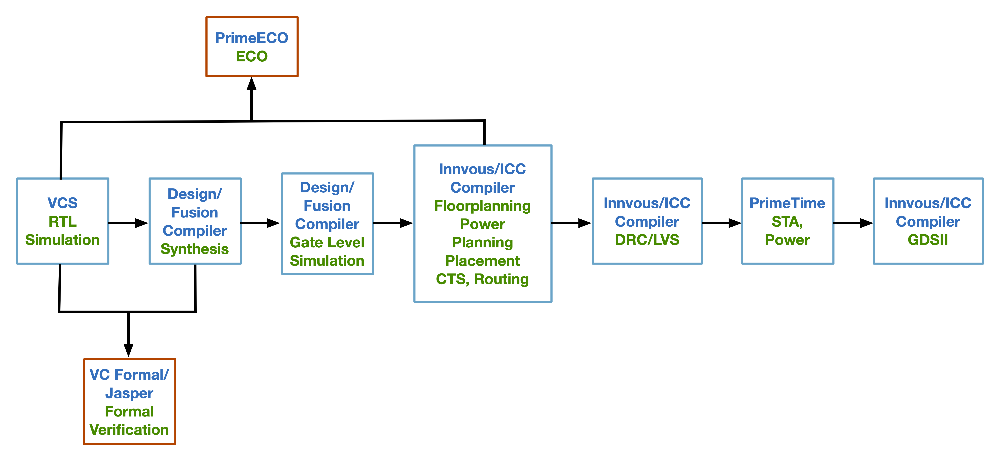

Coming out of college, I did not quite understand the lifecycle of a chip from ideation to its eventual tapeout. And in the years I have been working and mentoring college students, I have heard similar concerns! This is quite understandable since chip design information can be quite opaque, and the processes have massively matured beyond what school can teach. Even when students try to dive in by reading books or wikipedia pages, it can be hard to put together the various details. Given that semiconductors have been becoming increasingly important for deep learning (and national security!), we will go over an overview of what it takes to take a chip through it life until tapeout. 

*Disclaimers:*
1. *This post doesn’t reflect the views of any of the organizations I’m associated with, and also does not represent the actual processes those organizations follow. It is just an expression of my observations over time.*
2. *Most of the steps below overlap to some extent, if not completely. The objective is to disentangle the steps or "parallel processes" to help highlight the nuances.*
3. *My objective is to give an overview of the chip design process and highlight some quirks and intuition of what happens behind the scenes, so that readers can use that as a foundation for further reading. It is not meant to be comprehensive or self-explanatory*.

<!--   -->

#### Table of Contents
1. [Architecture Exploration](#architecture-exploration)
2. [Design Execution](#design-execution)
3. [Verification](#verification)
4. [Physical Design](#physical-design)
5. [Pre-Tapeout Checklist](#pre-tapeout-checklist)

### Architecture Exploration
When we build a chip, we basically want to provide a computing platform to the end user with useful *features*. The feature can be provided either in hardware or software. Hardware features are those which have hardware acceleration. Specifically, the chip has transistors that does a specific function when given the appropriate command or instruction. Software features are software programs (API, packages etc. ) that make it easier to use the hardware either for performance, usability or efficiency. The architecture exploration phase is used to determine what new features we want in hardware or software (or the compiler too, in recent times).

#### Framework for exploration
Given that we are basically doing research for the next generation of the chip, we want to be able to develop a framework which guides our direction and decisions. Let us look at some important considerations of this framework.
- **Pain points of previous/other chips** : A primary motivator of new features is the feedback we have from previous features in prior chips. Based on customer usage or internal experiments, we have learnt the good, bad and ugly of what we built previously or what other chips have built. We can learn from all these experiences to inform our future designs. 
- **New applications** : There might be new workloads or applications that need to be better supported, or just supported for the first time. For example, early GPUs primarily supported matrix multiplication for deep learning, but as networks evolved and new types layers were created, GPUs had to accelerate batchnorm, beam search etc.  
- **Market** : Different markets like datacenters, graphics, automotive and healthcare will have specific needs. Given the subset of markets we want to target, the features will need to be general enough to help all necessary domains, or we might need different features for different markets. 
- **Customers** : Some customers might have very specific requests, just for them. Within each market segment like datacenter, Microsoft has slightly different optimizations it might need over Meta and Google.  If a customer is particularly important to you, then you have to balance between satisfying the customer's request and your own vision. 
- **Backward Compatibility** : This is more of a consideration to companies having a history of prior chips, rather than startups. The company needs to decide how much legacy compatibility the new chip needs to have. Keeping too much legacy compatibility can often hinder major innovation, but completing ignoring backward compatibility can make it easier for customers to switch to your competitors. Finding the right balance is key
- **Cost** : Great ideas are awesome, especially when they improve PPA (performance, power, area). But when developing chips, the benefit needs to be balanced by the cost. This cost includes financial, human development (and verification) hours and risk of success. Sometimes smaller ideas might have a higher utility/cost ratio, so they might want to be prioritized.

#### Feature vetting
Using the above framework, we get together architects, ASIC designers, compiler engineers, firmware/kernel developers and application engineers together to now brainstorm and suggest investigate new features. Each new proposal is thoroughly vetted from all angles possible, by a group with diverse expertise, while adhering to the above requirements. Such vetting is done using a variety of *tools*, which we discuss below:
- **High level analysis** : Often the first tool used to discuss ideas. This could be a text writeup, block diagram, or excel analysis. It helps motivate the idea and rule out ideas early in the process if they don't pass the smell test, have glaring concerns or don't meet requirements.
- **Hardware feasibility** : Every feature needs to go through a hardware feasibility analysis. It can involve 
  1. Area overhead due to new data structures.
  2. Power, routing and cooling cost, in case we blow through those budgets.
  3. Design complexity, if the idea cannot be built within the proposed project timeline. This can often be expanded to microarchitecture investigation.
  4. Compatibility with current hardware, since features that are completely against present designs can often be much harder to implement just due to the tension arising.
- **Programming model and Software exposure** : Being able to use the hardware feature effectively in software and by the compiler is essential, otherwise the utility of the feature is moot. It should be convenient to use, achieve peak performance easily, and fit in well with the existing programming model. Questions to consider include: what would an API look like? Do we need a new instruction? Do we need new memory layouts? Do we need new software primitives and constructs? 
- **Simulation studies** : Most chips have a simulator associated with them, which helps give a high level software program that simulates the performance (maybe power too) of the chip. They can often be cycle accurate, though those can be complex and time consuming to maintain. It is useful to prototype the idea on the simulator to see the benefit we get, which gives a *more* realistic (but far from perfect) measurement of the utility.
- **Prototyping** : The closest one could come to vet an idea, short of building it completely, is prototyping the proposal on actual hardware. This gives hard numbers in actual development tools, like RTL, Synopsys/Cadence synthesis and PnR (Place and Route). But this is also extremely expensive to do due to complexity and high effort needed. Such prototypes often inform microarchitecture (discussed later)

During the above vetting process, we see whether it is worth pursuing a hardware acceleration solution for a feature or not. This divide is important since using actual silicon transistors is expensive real estate. If the benefit of having a hardware solution is not particularly high, it makes more sense to let it be done in software.
After an idea is completely vetted via a subset of the above tools, it is finally cleared for development!
 

**P.S.** We include *microarchitecure exploration* in the exploration phase, but this post covers that under design execution to avoid making this heading too long.

### Design Execution
After a feature has been approved by all relevant parties, we go into microarchitecture development and design execution.

#### Microarchitecture
This refers to mapping the new feature into actual hardware. The ASIC designers and architects discuss the nitty gritty details of the hardware design to make sure it achieves the essence of the feature without undue cost. The main considerations during are detailed below:
- **Storage** : New features need to often either modify existing data structures, or add new ones. This can lead to increase in area and complexity. Design decisions include: Do we need [SRAM](https://en.wikichip.org/wiki/static_random-access_memory), [Content Addressable Memory (CAM)](https://citeseerx.ist.psu.edu/document?repid=rep1&type=pdf&doi=9e030d3f873d9176e6452b092d145095108ff261), or registers? How many ports do we need? Do we need just a scratchpad storage or FIFOs? What is the width and height of this storage (yes that [changes area and power consumption](http://www.jestr.org/downloads/Volume9Issue5/fulltext23952016.pdf) of a RAM)?
- **Datapath and Control** : We will need to do some math operations to compute results. The hardware for doing these operations will need to be designed. Design decisions include: What is the precision of the datapath (i.e. Integer, FP32 etc.) and the accumulator? How wide is the datapath going to be? What are the considerations for overflow and underflow of the results? 
We will also need to design the control of this datapath to ensure it functions correctly. For example, we might design a completely pipelined datapath, which might have hazards, or an FSM like atomic datapath. 
- **Interconnect** : Creating the communication architecture involves defines interfaces (and their widths), packets vs dedicated wires and flow control protocol ([valid-ready](http://www.cjdrake.com/readyvalid-protocol-primer.html), TCP-IP, something custom etc.). We might even need to come up with a topology, virtual channels needed, credit requirements etc. This is a [good book](https://www.amazon.com/Principles-Practices-Interconnection-Networks-Architecture/dp/0122007514) for anyone interested to delve deeper into the material.
- **Timing** : Since hardware logic is evaluated at clk edges, [timing diagrams](https://www.youtube.com/watch?v=7Gf7N424v3k) are very helpful to understand the functionality. This can be for pipelines, Finite State Machines, RAM reads/writes or some critical functionality that needs deep understanding. Such an analysis also helps in honing down on the actual performance the chip will be obtaining, instead of using the projected one in the architecture stage.
- **Power** : The hardware needs to operate within a power budget. The designers need to estimate the power (especially for mobile chips) by accounting for area and toggle rate. The feature might be unviable if the power consumption is too high to tapeout. More on this in the [Physical Design](#physical-design) section.
- **Miscellaneous** : There are many other concerns that often come up at the microarchitecture phase like deadlock/livelock analysis, forward progress and fairness guarantees, and ordering guarantees. If there are arbiters, we need to choose between round-robin, strict priority or something in between. If the chip considers some work "higher priority", it needs to make sure it does not starve the lower priority work. Additonally, the chip needs to guarantee the ordering requirements defined in the architecture, and making sure the correct interlocks are designed to achieve them.

During this process, designers and architects often realize that the feature might be more expensive than desired, too complex or doesn't fit well with the existing design. In such cases, they often have to visit the previous phase to decide if we want to change or trim down the feature.

#### Development
After the microarchitecture has been settled, the chip is finally in development! More specifically, ASIC designers are writing RTL (Verilog or VHDL) or [High-level Synthesis](https://www.youtube.com/watch?v=LNjspRBjNDE) code for the chip. This is an effort and time consuming part of the project, where engineers just got to think through each wire, combinational logic, and register and see how to use them to implement the microarchitecture. Unlike previous phases, this can often be a pretty quiet phase, with intermittent phases of discussion for code reviews or design feedback. Additionally, the verification phase, as we describe below, happens closely alongside the development.

### Verification
I think verification is probably the most important part of a chip design process. Unlike software releases, shipping hardware doesn't have the benefit of "hardware updates" to fix a problem that might arise. In most companies, verification teams tend to be the largest since they need to smoke out each tiny bug in the design, some of which only happens one in a million tests.

#### Randoms Test Vectors
The most common form of testing is generating constrained random stimulus and feeding that into the DUT (Design Under Test). Each test has a different seed, leading to a different test. Verification engineers design testbenches that satisfy the constraints of the input, and verify that the outputs are correct. The environment outside the DUT can either be a SystemVerilog testbench, or a C++ program. The testbench can compare the RTL outputs with a golden model, and it can also implement [assertions](https://www.doulos.com/knowhow/systemverilog/systemverilog-tutorials/systemverilog-assertions-tutorial/) to self check RTL outputs. Often, RTL tests can run really long, so it becomes useful to check intermediate results inside the RTL to catch errors as soon as they manifest. This can be done either through RTL assertions, or by the testing program using [XMR](https://www.intel.com/content/www/us/en/docs/programmable/683082/22-3/cross-module-referencing-xmr-in-hdl-code.html) to extract signals and check them regularly.

An important aspect of random testing is coverage. We want to make sure that these random tests exercise the RTL in all possible combinations, so that all possible inputs are covered. Note that this is not just the inputs at a particular time $$t$$, but for all $$0 \le t \le T$$, where $$T$$ is the length of the test. The search space is exponentially large, hence hitting a 100% coverage is really hard! Additionally, we want to toggle all combinations of the logic written i.e. if we have $$N$$ bits in the RTL, we want to cover $$2^{N}$$ combinations. There are a few ways that ASIC engineers deal with this:
- Not all possible combinations of inputs and logic are legal. We will "waive" the combinations that are not legal.
- We will live with less than $$100\%$$ coverage. This is risky, and the engineers need to carefully evaluate how and when this is ok.

One way to increasing testing coverage is by using artificial stalling. Key pipeline stages or registers are artificially stalled to mimic real world scenarios that might happen. This stalling is done by introducing a [skid buffer](https://chipmunklogic.com/digital-logic-design/designing-skid-buffers-for-pipelines/), so that the data coming into the registers can be temporarily stored while the stall is enabled. As long as the stall is enabled, the data is not advertised. Once the stall is removed, the data is allowed to flow through. If designers waited for a realistic test to test such a stalling scenario, it might be really hard. Instead, they articially induce the scenario!

Hardware designs also need to verify [X-propagation](https://www.techdesignforums.com/practice/guides/x-propagation/) and perform [Gate-level simulations (GLS)](https://www.linkedin.com/pulse/gate-level-simulation-comprehensive-overview-jerry-mcgoveran/). There are special testing suites that are designed to use [X-optimism and X-pessimism strategies](https://www.verilogpro.com/x-propagation-with-vcs-xprop/) to flush out an x-prop issues that might arise. As for GSL, not everyone does it, but it is often a critical tool for cutting edge chips. Synthesis netlists might not be completely accurately generated by the synthesis tool, so running regressions on them helps verify them. Additonally, GLS typically model gate level timing unlike RTL which just models the logic with no timing in between flops. This helps in verifying basic clock and reset functionality that might not be caught in RTL simulations.

#### Formal Verification
My favorite form of verification is using formal methods. They come in two flavors: [Formal Verification](https://www.cerc.utexas.edu/~jaa/verification/lectures/3-2.pdf) and [Semi-Formal verification](https://www.cerc.utexas.edu/~jaa/verification/lectures/15-2.pdf). 

The idea is to write asserts and properties (static and temporal) that are thought to be always true, and the formal environment proves whether the properties are true. Since it is a proof, we are not leaving the functionality to chance. The RTL is black-boxed and all combinations of inputs are toggled to see if any combination causes the properties to fail. [Binary Decision Diagrams](https://www.cs.ox.ac.uk/files/4309/97H1.pdf) are used to perform this exploration. This does come with its challenges. Designers need to write properties and assertions to cover as much of the functionality as possible. Additionally, the proofs can be fairly complex due to the large input space, so getting a definitive proof can be hard. Instead, people look for "[bounded proofs](https://www.cs.cmu.edu/~emc/papers/Books%20and%20Edited%20Volumes/Bounded%20Model%20Checking.pdf)", where the proof is checked until a certain human set cycle depth, rather than exhaustively. To reduce the search space, we can add constraints to the inputs if we know for certain some combination or path in the BDD is not ever plausible. Such constraints need to be carefully reviewed in order to avoid false positives.

A middle ground between pure simulation testing and formal verification is Semi-Formal verification. Since proof depths can be pretty large, and it is possible to overconstraint the inputs, we might want to run the properties we designed above in the simulation environment to ensure they are also satisfied. We can also guide the simulations using the formal environment to help direct the random testing to target corner cases. In general, such methods are also useful to verify high replicated logic and blocks like clock, reset, FIFOs, Arbiters, clock domain crossing (CDC) etc. Companies typically have formal teams that design such testbenches, add properties, and run proofs and simulations. Increasingly, these teams are been increasing in size due to the necessity of verifying that one in a million bug randoms might find it hard to catch.

### Physical Design 

RTL is written as a program which is verified in simulation. The process of converting this program of logic into actual physical structures that embody gate/transistor-level delay, resistance, capacitance and voltage information comes under physical design. This is sometimes called the "backend" of the chip design process.

#### Synthesis
The first aspect of synthesis is converting the RTL into gates, wires and flops. This is done using either paid tools like Synopsys DC compiler or open source tools like [Yosys](https://github.com/YosysHQ/yosys). The foundry (TSMC, Samsung, Intel) provides a standard cell library which contains the timing and area models for basic gates like NAND, OR, NOT, AND, and XOR, potentially along with custom flop designs. They have to go through a "characterization" process to make models suitable for chip design flows. Each semiconductor node has its own cell library, and sometimes improved cell libraries are provided to optimize for power and area. It is also used to determine whether the RTL logic satisfies the physical constraints required by fab, given the operating clock frequency of the chip. Some important physical characteristics of the library and netlist are:
- **Drive Voltage** : This is the operating voltage of the gate. Higher voltages allow for faster switching, which means faster transistors and lower delay. But higher voltage also means more power.
- **Threshold voltage** : This determines the voltage at which the transistor turns on. Higher voltages means more effort to turn the transistors on, but also lower leakage current.
- **Leakage** : This is the amount of current and power that is dissipated when the transistor is idle.
- **Fanout** : A single gate might be driving wires to many other gates, and this is called the fanout. 
- **Buffers** : If the length of the wire is too long between two gates, we might need buffers in between (NOT gates) so that we can ensure the drive current is maintained at a steady level. 

At the end of synthesis, we get a *.gv file with the netlist. We also get timing reports containing the critical paths that do not meet the timing model in the cell library and within the clock period budget. If the delay of the combinational logic between two registers is larger than the clock period ([setup time](https://www.vlsi-expert.com/2011/04/static-timing-analysis-sta-basic-part3a.html) is violated), then those need to be fixed in RTL appropriately to make the chip physically functional. There is also where an initial sizing of the transistors done, based on the fanout and timing that needs to be met. Note that the larger the length of the transistor, the lower the resistance, and hence the faster the transistor.

An important part of synthesis is "[optimization](https://www.eng.biu.ac.il/temanad/files/2017/02/Lecture-5-Synthesis.pdf)". The tool tries to minimize the amount of gates generated from the RTL. It can either be through Boolean minimization, or my merging registers if possible. The tools can also infer clock gates based on sequential assignment in RTL. All together, this helps in reducing power and area and lowering timing pressure. 

#### Place and Route (PnR)
Once we have the gates, their constraints and sizings, we go through a [placement](https://web.eecs.umich.edu/~mazum/PAPERS-MAZUM/cellplacement.pdf) and [routing](https://web.eecs.umich.edu/~mazum/ClassDescriptions/Routing.pdf) phase. The placement stage involves planning how to place the gates on the chip floorplan. Specifically, we want gates that feed one another to be close to each other so that we meet physical constraints i.e. we want to minimize the interconnect length using the Manhattan distance metric (which also helps meet timing). During this stage, every gate or IP is considered a bounding box of an appropriate size. The general methodology is to place macros and large indivisible logic chunks first, and then putting the smaller gates and dynamically generated transistors. This means that RAMs, FIFOs, foundry IPs etc. are first placed optimally, and then the space in between is filled with the remaining logic written by the designer. Doing globally optimal placing is an NP-hard problem, so we need to use approximation algorithms like simulated annealing to get a relatively optimal placement. As a result, the placement can often differ a little across runs for the same netlist. There are a few important things to note about the placement phase:
- Timing can become better or worse for different paths as compared to the synthesis netlist. This is because the wires between two flops or gates can longer or shorter depending on where the gates are physically placed. As a result, RTL might have to be modified (again!) to meet the new physical requirements.
- The tool has a variety of different [process corners](https://semiengineering.com/process-corner-explosion/) it can use to meet timing and fanout requirements. The process corner defines the mobility of the NMOS and PMOS transistors in the gate, which determines how fast they can switch from $$0 \rightarrow 1$$ and vice-versa. It is completely possible that the same gate uses different process corners when used in different logic paths.
- The placement stage has a "technology mapping" phase also associated with it. Synthesis uses standard cells to model physical characteristics, but it is in this tech mapping phase where we actually map the gates into transistors, wires, tracks etc. As a result, the final transistor sizing for area and the driven load is done here.

Placement is followed by clock tree synthesis (CTS) and then routing. CTS is covered in the next section, so we will first cover routing. Routing is the process of finding the shortest distance for the wires between various gates. Note that that gates are placed as boxes, and the routing is done along a grid i.e. horizontally or vertically.  There are two constraints routing needs to satisfy for manafacturability:
- **Design Rule Check (DRC)** : Manufacturers like TSMC define a set of design rules for each process node that they offer. These rules aid in making manafacturing easier, verify the mask set and increase process yield (really important!). Rules include the width of the metal tracks for wires, the spacing between these metal tracks, and the amount of surrounding metal needed by things like vias. 
- **Layout Vs Schematic (LVS)** : Post routing, the tool needs to ensure that the layout matches the intended circuit. This is more of a sign off check to ensure that there was no error during the place and route stages.

The main stages of routing are as follows:
1. **Global routing** : We find the shortest path between the gates, as required by the netlist. Congested areas are avoided and minimized, and metal layers are assigned to the various nets. The tool tries to avoid Power/ground rails, or any other pre-routed wires. [Various algorithms](http://cc.ee.ntu.edu.tw/~ywchang/Courses/PD_Source/EDA_routing.pdf) are used to do such routing, the popular one being Steiner Tree and Maze algorithm. Physical properties like signal integrity, crosstalk and reliability are taken into consideration along with the pure manhattan distance.
2. **Track assignment** : [This stage](http://users.ece.northwestern.edu/~haizhou/publications/iccad02.pdf) puts down the physical horizontal and vertical tracks on the various metal layers assigned to the routes. Since these are physical tracks, we want to minimize the number of turns done since each turn creates a via and also has undesirable physical characteristics. Each metal layer has the tracks traveling in a specific pre-determined direction, so the tool needs to change metal layers if the direction of a route changes. Note that power and clk/reset have their own layers.
3. **Detail routing** : We finally start to fix the DRC violations to ensure design for manafacturing. Wires are either spread out to meet minimum distance, or made closer to fill up gaps. 
4. **Search and repair** : Any continued violations form the previous step are fixes and appropriate rerouting is done.

At the end of the routing stage, the tool emits a DEF file, a timing report, congestion report, the geometric layout and buffer/skew insertion.

#### Power and Area
The physical design process also provides us with critical information about power and area, which is reasonably representative of the real world chip (to a degree of precision). 

Once we have the netlist (and post PnR layout/def file), we can run directed tests to see the corresponding power and energy dissipation. Each gate and wire has a power model, which is based on voltage, capacitance and clk frequency. Specifically, it is some form of $$\frac{1}{2}CV^{2}f$$, where $$C$$ can be a combination of gate, source and drain capacitance. Power can be either leakge or dynamic power. Leakge power is the power dissipated when voltage is applied at the gates, but there are no toggles. This is a property of the transistors based on its physical characteristics like threshold voltage. Faster transistors tend to have higher leakage power. On the other hand, dynamic power is directly proportional to toggles, i.e. switching between 0 and 1 per bit wire, generated by the test. A modification of power is energy. Power is defined as $$\frac{\text{Energy}}{\text{Time}}$$. If the power is halved, but the time doubled, the energy consumed remains the same. Hence, if we want to reduce the energy consumption of a chip, power alone is not a sufficient metric. In fact, an important metric to compare different chips is the energy-delay product or Perf/Watt. To put things in perspective, in real hardware, a MAC (Multiply Accumulate i.e. Multiply-Add) operation often consumes only ~$$50$$ fJ of energy, and takes a few $$\mu W$$ of power! 

An interesting intuition about power comes with the relationship between voltage and clock frequency. Lower voltages lead to slower transistors (due to higher switching times), as a result of which the clock frequency needs to also be reduced. As a result, we can get a cubic reduction in power by just lowering voltage and the corresponding clock frequency. Another observation is that memories and gates can often operate at different voltages, with different voltage ranges of operation. Different parts of the chip can also run at different clock frequencies. All these variations need to be independently accounted for when calculating overall power. Oh and let us not forget the operating temperature itself. When the chip runs hot, the transistors slow down and start throttling. Any increase in voltage (manual or automatic) to make them run faster does not lead to increased performance, but does lead to massive increase in power consumption. 

Synthesis and PnR also report area, typically in $$\text{um}^{2}$$ for specific logical elements or $$\text{mm}^{2}$$ for subset of or entire chips. We get a division between combinational logic, sequential logic and RAM area, all of which are segregated by the tool. For hard IPs like RAMs, the tool needs to synthesize them separately and then add the area to the synthesized area. Apart from the logic actually put down in RTL, there are a few other considerations that affect area:
- **Cell Sizing** : Transistor sizing is an essential part of the physical backend. We can choose the length of the transistor depending on the RC delay we would like. In general, the resistance is $$\propto \frac{W}{L}$$, which means that if length increases, then we get a reduction in resistance, leading to faster transistors. Hence, if our chip is finding it hard to meet timing, it can often choose larger transistors for the gates in order to reduce delay. Such choices lead to "timing bloat". Reducing this timing pressure, even by adding more gates, can often reduce overall area by reducing timing bloat.
- **Buffers** : As we mentioned above, the synthesis tool adds buffers to long wires to maintain drive strength in the path. Specifically, voltage and current drive can reduce with distance, and buffers compensate for that without materially changing the functionality. This comes at the cost of area! And again, reducing the length of a wire reduces the number of buffers and reduces area.

#### Miscellaneous

There are some important checks that need to be done, and some processes available to us to shorten development time. 
- **Formal equivalence** : We need to make sure that the RTL and the synthesized netlist are formally equivalent. This ensures that the tool did not make any errors while generating the gates.
- **Engineering Change Orders (ECO)**: [ECOs](https://www.synopsys.com/glossary/what-is-functional-eco.html) are tools that help us patch the netlist directly for a specific piece of logic without needing to resynthesize the entire RTL. Specifically, we design the minimum amount of RTL needed, synthesize that and directly patch that into the larger netlist. This process is useful to avoid the long time needed to synthesize the RTL, so it does reduce turnaround time. But doing such a change is very sensitive and requires great care, since we are directly changing individual gates or even metal layers in many instances. 

### Pre-Tapeout Checklist
After PnR, we need to do some checklist items. They are considered "checklist" but in fact have significant impact on the chip, and require a lot of engineering ingenuity. 

#### Clock Tree synthesis (CTS)
[This step](https://anysilicon.com/clock-tree-synthesis/) comes after placement but before routing. Essentially, this is the place and route step specifically for the clock. Clocks are usually placed on their own metal layer (typically M1 or M2 i.e. the top 2 metal layers) to avoid congestion and inteference with other signals and wiring. They also consume a majority of the energy on a chip (upto $$65\%$$!), excluding DRAM. We want to put the [Phase locked loops (PLL)](https://www.analog.com/en/analog-dialogue/articles/phase-locked-loop-pll-fundamentals.html) in the appropriate places so as to distribute and synchronize the clock correctly. Typically, there is a source PLL (around the center of the chip), and there are multiple PLLs across the chip to synchronize the clock, in case its needed for reasons we look at below:
- **Clock Skew** : Ideally we would want the clock pulse to rise and fall at the exact same time for all registers in the chip. But the clock signal takes time to travel, so between two registers on a path, it might rise and fall at different times, leading to a "skew". On first glance, it might seem like a nuisance (and it can be), but it is often used by physical designers to increase the time available for a signal to travel between registers, hence also making it easier to meet timing. In general, we want the skew to be balance based on distance from the source, and depending on the chip design, we choose a clock tree architecture (discussed later).
- **Clock Slew** : We often think of digital signals as going to 0 or 1 instantly, but in reality, it takes some ps (yes, picoseconds) for them to transition. This is especially important for the clock since all timing is synchronized to the clock. The rise and fall time (aka transition time) is known as clock slew. This affects the dynamic power dissipated, which is essential given that CTS dominates power.
- **Clock Tree Architecture** : To balance the various idiosyncracies of the clock, and the chip floorplan, we can choose a way of distributing the clock from the source. We can use a mesh or H tree. At regular intervals, we often have other clock sources (apart from the main source) in order to avoid too high a clock skew or divergence.

There are a few other things that designers consider. For example, due to the extensive nature of the clock, crosstalk is a big concern. Other signals might become aggressors and subsequently impact the clock by either delaying or quickening the clock, or even causing glitches. This may also affect the setup and hold times, which are critical to ensure functionality. To avoid such effects, designers often shield the clock wires or put them far apart from specific aggressors. As we see, the details are really exciting (but sometimes tedious)!

#### Physical Signoff
Finally, we need to complete our physical design! Lets look at a few things (out of many others) that designers need to do before tapeout.
- **Emulation** : Until now, all the hardware circuits were being simulated in software. Now, they are being emulated on FPGAs on actual hardware gates. The gates are mapped to the reconfigurable FPGA gates, and then the software is run on top. The key benefit is the massive speedup we get in running tests, which also enables us to run larger designs. For example, if a chip has 1024 cores, we might be able to simulate only 16 in Synopsys. But in emulation, we can potentially simulate all 1024 cores! This helps us find corner case hardware bugs that might have been hidden in the smaller simulations earlier. 
- [**Power Distribution Network**](http://emlab.uiuc.edu/ece546/Lect_20.pdf) : We saw how to do CTS. Similarly, we need to place and route power and ground rails throughout the chip to provide $$V_{dd}$$ and $$V_{ss}$$ to the gates. Typically, its a mesh network and can be on multiple metal layers, depending on how many metal layers the chip has. A lot of considerations go into this. Power jitter due to noise is common problem, and this can cause variations in drive strength and current. Bypass capacitors are added to smoothen this out and provide extra electric charge at certain times. Designers also need to choose the type of signaling. Differential signaling is a common technique used in modern chip. Dynamic voltage scaling is also a common optimization used by engineers to save power when the chip is not too busy, where the voltage and clock frequency are lowered simultaneously. If you are interested in such ideas and circuits, the [Digital Systems Engineering](https://www.amazon.com/Digital-Systems-Engineering-William-Dally/dp/052106175X) book is an awesome reference!
- **[IR Drop](https://teamvlsi.com/2020/07/ir-analysis-in-asic-design-effects-and.html)** : Voltage delivery occurs using actual wires, which have resistance and capacitance. As a result, the power reaching the transistors is lower than the intended value, and this difference is called the IR drop. Since wires are becoming thinner and longer, the resistance is drastically increasing which leads to larger IR drops, making it a real problem. Companies tend to manually measure them to see what the actual operating voltage of the gates is, which helps in measuring power and performance. They try to work around the problem by using wider wires for power, or by using bypass capacitors to provide extra power when needed to compensate. 

At the end of all the hard effort, the tool constructs a GDSII file, which is the format accepted by fabs like TSMC and Samsung. Fun fact: The process is called tapeout because back in the day, the file was actually stored in actual tapes and delivered to the fabs. 
Keep in mind that there is so much more magic that happens after this, including the fabrication process and the chip bringup itself. Those topics are for another day .... 

I probably missed details in the post above that might have been useful to highlight, describe or just mention. If you think so, do leave a comment below and I will try to incorporate them!
